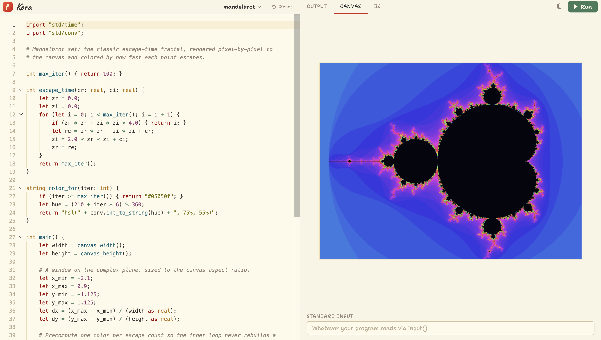

<h1>
    
    <span> Kora </span>
</h1>

Kora is a small, statically typed, programming language with a garbage collector. It compiles to native executables and JavaScript. Your programs run right
in the browser with nothing to install.

**[Read the docs](https://gnikdroy.github.io/kora/)** &middot; **[Try the online playground](https://gnikdroy.github.io/kora/play/)**

<picture>
  <source media="(prefers-color-scheme: dark)" srcset="docs/src/assets/playground_dark.png" />
  
</picture>

## Features

- Familiar C-like syntax: `if` / `while` / `for`, functions, and blocks you
  already know.
- Static typing with inference: `int`, `real`, `char`, `bool`,
  arrays, and strings.
- Arrays and strings with handy built-in methods (`push`, `pop`, `insert`,
  `remove`, `slice`, `extend`, `len`). A `string` is just an array of `char`.
- Structs and methods: POD types `struct`, attach behavior with
  `impl`.
- Generics over type parameters for `struct`, `impl`, and functions
  (`struct box<T>`, `T id<T>(x: T)`), instantiated with turbofish
  (`id::<int>(5)`, `new box<int>{ v: 1 }`). Instances are monomorphized, so
  generics cost nothing at runtime.
- Functions are first class values. Pass, store, and return functions by value with the
  for callbacks, dispatch tables, and higher-order functions.
- Optionals (`T?`) instead of null. [The billion-dollar mistake](https://computerhistory.org/blog/in-memoriam-sir-antony-hoare-1934-2026/)
- Runtime safety is a design choice: array indexing is
  bounds-checked, integer division by zero, `pop()` on an empty array, and
  force-unwrapping `none` all panic with a clear message instead of
  corrupting memory.
- Modules which allow you to split a program, plus a small
  standard library (I/O, string helpers, math, and conversions) written in
  Kora.
- The native runtime written in C, the lingua-franca of programming languages.
- Runs in the browser through a WebAssembly-powered playground, and compiles
  to native binaries through an LLVM backend (LLVM 21 is required).

## A taste of Kora

A generic stack, showing type inference, arrays, and generics over structs and
impls:

```ruby
import "std/io";
import "std/conv";

# A generic growable stack, built on a plain array.
struct stack<T> { items: [T] }

impl stack<T> {
    void push(self, x: T) { self.items.push(x); }
    T pop(self) { return self.items.pop(); }
    int size(self) { return self.items.len(); }
}

int main() {
    let s = new stack<int>{ items: [] };   # inferred: s : stack<int>
    for x | [1, 2, 3, 4] {
        s.push(x * x);
    }

    let sum = 0;
    while (s.size() > 0) {
        sum = sum + s.pop();
    }

    io.write(conv.int_to_string(sum));      # 30
    io.write("\n");
    return 0;
}
```

The playground has proper Kora syntax highlighting. Sorry for the `ruby` code blocks here.

For more, [`res/cli/`](res/cli/) has terminal programs (a Sudoku solver, a ray
tracer that renders to a PPM file, a calculator REPL, and a word counter) and
[`res/playground/`](res/playground/) has playable versions of Snake, Tetris,
Pong, Pacman, Doom, and a Mandelbrot renderer.

## Architecture

One frontend feeds two backends. Source is lexed and parsed per module,
assembled and import-resolved into a single program, monomorphized, then checked
in three passes. Both backends lower the checked program to the same typed IR,
so the native binary and the JavaScript output stay byte-identical.

```
╔═══ COMPILER FRONTEND ══════════════════════════════════════════════════╗
║           ┌──────────────────────────────────────────────┐             ║
║           │ Source files  (.kora + imported modules)     │             ║
║           └──────────────────────────────────────────────┘             ║
║                                  │                                     ║
║                                  ▼                                     ║
║           ┌──────────────────────────────────────────────┐  per module ║
║           │ Lexer                             src/lexer  │ ◀───┐       ║
║           │ characters ──▶ tokens                        │     │       ║
║           └──────────────────────────────────────────────┘     │       ║
║                                  │                             │       ║
║                                  ▼                             │       ║
║           ┌──────────────────────────────────────────────┐     │       ║
║           │ Parser                           src/parser  │ ◀───┤       ║
║           │ tokens ──▶ AST                               │     │       ║
║           └──────────────────────────────────────────────┘     │       ║
║                                  │                             │       ║
║                                  ▼                             │       ║
║           ┌──────────────────────────────────────────────┐     │       ║
║           │ Loader + Import Resolver         src/loader  │ ────┘       ║
║           │ assembles parsed modules; resolves imports   │             ║
║           │ ──▶ LoadedProgram (module graph)             │             ║
║           └──────────────────────────────────────────────┘             ║
║                                  │                                     ║
║                                  ▼                                     ║
║           ┌──────────────────────────────────────────────┐             ║
║           │ Generic Instantiator        src/instantiate  │             ║
║           │ monomorphize <T>; fill concrete              │             ║
║           │ structs / impls / calls                      │             ║
║           └──────────────────────────────────────────────┘             ║
║                                  │                                     ║
║                                  ▼                                     ║
║           ┌──────────────────────────────────────────────┐             ║
║           │ Symbol Resolver                              │             ║
║           │ src/semantic_analyzer/symbol_resolver        │             ║
║           │ symbol-table pass; cross-module binding      │             ║
║           └──────────────────────────────────────────────┘             ║
║                                  │                                     ║
║                                  ▼                                     ║
║           ┌──────────────────────────────────────────────┐             ║
║           │ Type Checker                                 │             ║
║           │ src/semantic_analyzer/type_checker           │             ║
║           │ infer & check types; resolve methods         │             ║
║           └──────────────────────────────────────────────┘             ║
║                                  │                                     ║
║                                  ▼                                     ║
║           ┌──────────────────────────────────────────────┐             ║
║           │ Return-Flow Analysis                         │             ║
║           │ src/semantic_analyzer  (ReturnChecker)       │             ║
║           │ every path returns a value                   │             ║
║           └──────────────────────────────────────────────┘             ║
║                                  │                                     ║
║                                  ▼                                     ║
║                                                                        ║
║               CompiledProgram   (checked AST + types)                  ║
║                                                                        ║
║                                  │                                     ║
║                                  ▼                                     ║
║           ┌──────────────────────────────────────────────┐             ║
║           │ Typed IR Lowering                    src/ir  │             ║
║           │ Name Mangling                    src/mangle  │             ║
║           │ monomorphic ops, finalize mangled symbols,   │             ║
║           │ explicit Wrap/Unwrap / Copy, lvalue detection│             ║
║           └──────────────────────────────────────────────┘             ║
║                       typed IR  (ir::Program)                          ║
╚════════════════════════════════════════════════════════════════════════╝
                                     │
                                     ▼
╔═══ COMPILER BACKEND ═══════════════════════════════════════════════════╗
║                                  │                                     ║
║                 ┌────────────────┴────────────────┐                    ║
║                 ▼                                 ▼                    ║
║  ┌────────────────────────────┐    ┌────────────────────────────┐      ║
║  │ JavaScript Transpiler      │    │ LLVM Lowering Pass         │      ║
║  │ src/javascript_transpiler  │    │ src/codegen  (inkwell)     │      ║
║  └────────────────────────────┘    │ emits an LLVM IR module    │      ║
║                 │                  └────────────────────────────┘      ║
║                 ▼                                 │                    ║
║  ┌────────────────────────────┐                   ▼                    ║
║  │ Async Coloring pass        │    ┌────────────────────────────┐      ║
║  │ marks fns that block on    │    │ Object File Emission       │      ║
║  │ an async extern as async   │    │ src/codegen (TargetMachine)│      ║
║  └────────────────────────────┘    │ LLVM IR ──▶ native .o      │      ║
║                 │                  └────────────────────────────┘      ║
║                 ▼                                 │                    ║
║  ┌────────────────────────────┐                   ▼                    ║
║  │ Emit JavaScript            │    ┌────────────────────────────┐      ║
║  │ + runtime inclusion:       │    │ Linking                    │      ║
║  │ kora_node_runtime.js /     │    │ src/codegen::link          │      ║
║  │ kora_browser_runtime.js    │    │ + libkora.c runtime        │      ║
║  └────────────────────────────┘    │ + Boehm GC  (bdwgc)        │      ║
║                 │                  └────────────────────────────┘      ║
║         ┌───────┴───────────┐                     │                    ║
║         ▼                   ▼                     ▼                    ║
║  ┌─────────────┐ ┌────────────────────┐ ┌────────────────────┐         ║
║  │ Node.js     │ │ Playground         │ │ native executable  │         ║
║  │ (.js output)│ │ wasm compiler +    │ │ (LLVM 21 + linker) │         ║
║  └─────────────┘ │ browser runtime +  │ └────────────────────┘         ║
║                  │ canvas host worker │                                ║
║                  └────────────────────┘                                ║
╚════════════════════════════════════════════════════════════════════════╝
```

## Try it locally

```bash
wasm-pack build --target web --out-name compiler -- --no-default-features # build the wasm compiler
python -m http.server # serve at localhost
```

Then open the printed URL and start typing.

To compile programs to native executables instead, build the compiler.
Building the compiler requires lib LLVM 21 and a C compiler for the platform linker.

```bash
cargo build --release # build the compiler
kora program.kora -o program # native standalone binary
kora program.kora --emit-js  # or print the JavaScript
```

Running the test suite is `cargo test` (also requires LLVM 21).

## Grammar

```ebnf
module      = { import | struct | impl | extern | function } ;

import      = "import" STRING [ ident ] ";" ;

struct      = "struct" ident [ typeparams ] "{" [ member { "," member } [ "," ] ] "}" ;
member      = ident ":" type ;

impl        = "impl" ident [ typeparams ] "{" { method } "}" ;
method      = rettype ident "(" "self" [ "," [ param { "," param } [ "," ] ] ] ")" block ;

typeparams  = "<" ident { "," ident } [ "," ] ">" ;   (* generic parameters, e.g. <T> or <K, V> *)

extern      = "extern" ( "void" | externtype ) ident "(" externparams ")" ";" ;
externparams= [ externparam { "," externparam } [ "," ] ] ;
externparam = ident ":" externtype ;
externtype  = "int8" | "int16" | "int32" | "int64"       (* C types only *)
            | "uint8" | "uint16" | "uint32" | "uint64"
            | "float32" | "float64" | "bool" | "char"
            | "cint" | "cuint" | "clong" | "culong" | "csize"
            | ( "cstring" | "opaque" ) [ "?" ] ;

function    = rettype ident [ typeparams ] "(" params ")" block ;
rettype     = "void" | type ;
params      = [ param { "," param } [ "," ] ] ;
param       = ident ":" type ;

type        = rettype "(" [ type { "," type } [ "," ] ] ")" [ "?" ]  (* function type, e.g. int(int, int) *)
            | basetype [ "?" ] ;                                      (* "?" makes it optional *)
basetype    = "int" | "real" | "char" | "bool" | "string" | "opaque"
            | ident [ typeargs ]         (* struct name, or generic instance *)
            | "[" type "]" ;
typeargs    = "<" type { "," type } [ "," ] ">" ;   (* generic arguments, e.g. <int> or <int, string> *)

statement   = ";"
            | expr ";"
            | "let" ident [ ":" type ] "=" expr ";"
            | "return" [ expr ] ";"
            | "break" ";"
            | "continue" ";"
            | "if" "(" expr ")" statement [ "else" statement ]
            | "while" "(" expr ")" statement
            | "for" "(" forinit expr ";" expr ")" statement
            | "for" ident "|" expr statement
            | block ;
forinit     = ";" | expr ";" | "let" ident [ ":" type ] "=" expr ";" ;
block       = "{" { statement } "}" ;

expr        = assign ;
assign      = or [ "=" assign ] ;
or          = and  { "||" and } ;
and         = eq   { "&&" eq } ;
eq          = rel  { ( "==" | "!=" ) rel } ;
rel         = add  { ( "<" | ">" | "<=" | ">=" ) add } ;
add         = mul  { ( "+" | "-" | "|" | "^" ) mul } ;
mul         = cast { ( "*" | "/" | "%" | "&" | "<<" | ">>" ) cast } ;
cast        = unary { "as" type } ;
unary       = ( "!" | "-" ) unary | postfix ;
postfix     = primary { "(" args ")" | "[" expr "]" | "." ident | "!" | "::" typeargs } ;
                                                            (* "::" typeargs is turbofish: id::<int>() *)
args        = [ expr { "," expr } [ "," ] ] ;
primary     = INT | REAL | CHAR | STRING | "true" | "false" | "none"
            | ident
            | "(" expr ")"
            | "[" [ expr { "," expr } [ "," ] ] "]"
            | "new" type [ "[" expr "]"
                         | "{" [ field { "," field } [ "," ] ] "}" ] ;
field       = ident ":" expr ;
```
